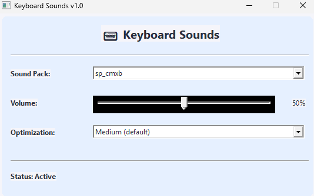

# Keyboard Sounds

A Windows application that plays customizable sounds when you type, with optimized performance and low latency.



## 🔊 Features

- Plays custom sounds for key presses and releases
- Multiple sound packs support
- Adjustable volume control
- Latency optimization settings
- Clean UI
- Minimal resource usage

## 📖 Technical Overview

### Architecture

This application is built using modern C++17 and integrates several technologies:

1. **Low-Level Keyboard Hook System**
   - Uses the Windows `SetWindowsHookEx` API to capture keyboard events globally
   - Implements intelligent filtering to avoid double-firing on auto-repeat
   - Detects injected keystrokes to avoid processing artificial input

2. **Predictive Sound Preloading**
   - Learns typing patterns to predict which keys are likely to be pressed next
   - Preloads sound buffers for commonly typed sequences
   - Prioritizes frequently used keys for minimal latency

3. **Multi-threaded Sound Processing**
   - Dedicated sound processing thread to avoid UI blocking
   - Priority queue system to handle rapid keystroke sequences
   - Intelligent cleanup of stale sounds to minimize memory usage

4. **SFML 3.0 Audio Integration**
   - Uses the latest SFML 3.0 audio system for high-quality, low-latency sound
   - Properly implements sound buffer caching and reuse
   - Manages sound resource cleanup automatically

5. **Dynamic Performance Tuning**
   - Four optimization levels to balance between latency and resource usage
   - Automatically adjusts processing behavior based on typing speed
   - Smart rate limiting to prevent audio clipping during fast typing

### Key Components

- **KeyboardHookManager**: Captures and processes keyboard events
- **SoundManager**: Handles sound file loading and selection
- **SFMLSoundPlayer**: Manages sound playback and caching
- **Application**: Provides UI and coordinates other components

## 🛠️ Building From Source

### Prerequisites

- Windows 10 or later
- CMake 3.14 or newer
- C++17 compatible compiler (e.g., Visual Studio 2019+, MinGW-w64)
- SFML 3.0 (not included)

### Setting Up SFML 3

1. Download SFML 3.0 from the [official website](https://www.sfml-dev.org/download.php)
2. Extract the SFML package
3. Create a `libs` folder in the project root
4. Create an `SFML` folder inside the `libs` folder
5. Copy the contents of the SFML package into the `libs/SFML` folder
   - Ensure the folder structure looks like: `libs/SFML/bin`, `libs/SFML/lib`, etc.

### Build Steps

```bash
# Clone the repository
git clone https://github.com/aledlb8/keyboard-sounds.git
cd keyboard-sounds
build.bat
```

### Running Your Build

The executable will be created in the `build` folder (Release configuration). Required DLLs from SFML will be automatically copied to the build folder.

To run the application:
```bash
cd build
./keyboard-sounds
```

## 🎮 Using Pre-built Releases

If you don't want to build from source, you can download the pre-built release packages from the [Releases](https://github.com/aledlb8/keyboard-sounds/releases) page.

1. Download the latest release ZIP
2. Extract to a folder of your choice
3. Run `keyboard-sounds.exe`

## 🎵 Sound Packs

1. Check the sounds folder, you can add your custom ones without changing a single line of code!

## ⚙️ Optimization Settings

The application offers four optimization levels that balance between performance and resource usage:

- **Minimal**: Better compatibility, less resource usage
- **Low**: Basic optimization with minimal preloading
- **Medium**: Balanced optimization (default)
- **Maximum**: Lowest possible latency, higher CPU/memory usage

## 🤝 Contributing

Contributions are welcome! Please feel free to submit a Pull Request.

## 📄 License

This project is licensed under the MIT License - see the [LICENSE](LICENSE) file for details.

## 🙏 Acknowledgements

- [SFML](https://www.sfml-dev.org/) for the excellent audio library
- All contributors and testers who helped improve this application